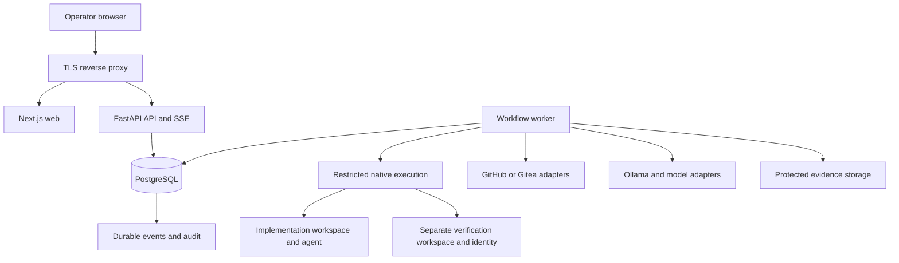

# NachtLabs implementation plan

**Status: operator authorized source implementation through all ten milestones without pausing for testing. M1–M10 source handoff; all execution checks remain NOT RUN. Milestone documents are stored in the project.**

Prepared September 25, 2026 from the supplied NachtLabs build specification. The operator subsequently authorized coding. Milestones 1–10 have source implementations; see [current status](docs/planning/milestone-10-status.md), [source review](docs/planning/source-review-m10.md) and [Linux handoff](docs/operations/milestone-10-handoff.md). Dependencies, builds, tests, migrations and services have not been executed. No Git commits or remote operations have been performed.

The build specification remains the source of requirements. The decisions below turn it into an implementation sequence with explicit boundaries, dependencies, and acceptance gates. The operator subsequently requested source review and continuation through all milestones without testing.

**Source-control agreement — local Git only:** The operator's organization has blocked the remote Git plugin. Development work on NachtLabs must use local files and local Git only. Do not use remote Git plugins, configure or contact Git remotes, fetch, pull, push, create remote PRs, or trigger remote CI. Do not substitute a CLI, API, or another tool to work around this restriction. Local status/diff/history inspection is permitted; creating commits still requires an explicit operator request. GitHub/Gitea remain planned NachtLabs product capabilities, but implementing their source does not authorize live remote access or integration testing. Use local repository fixtures for future operator-run Git tests; remote-provider acceptance remains deferred until the operator explicitly authorizes an available, organization-permitted environment. This restriction does not prevent authoring M1–M10 or preparing the Linux handoff.

**Updated working agreement — Windows authoring, operator-run Linux testing:** WSL is blocked by the operator's organization, and the coding environment is PowerShell on Windows. Current authorization: review source and author through **Milestone 10** without interim pauses, retaining milestone documents in the project. This supersedes the earlier mandatory Checkpoint A stop. The operator performs the Linux setup and testing. Do not execute tests, application builds, lint/type/format checks, migrations, services, health checks, or live integration probes before this handoff. Reading files, reviewing source, writing implementation/tests/scripts/documentation, and preparing the handoff remain allowed. This agreement overrides earlier requirements to run checks after every authoring milestone; it does not remove the checks or count them as passed. Checkpoint A is an authoring milestone, not a tested release. The operator has moved the authoring handoff to the end of M10; runtime compatibility proof remains deferred.

## 1. Proposed repository

```text
NachtLabs/
  apps/
    web/
      src/app/                     # Next.js App Router routes and layouts
      src/features/                # Forms, views, queries grouped by product area
      src/components/              # Shared application components
      src/styles/                  # Semantic tokens and six themes
      tests/
    api/
      src/nachtlabs_api/            # HTTP routes, auth dependencies, SSE, middleware
      migrations/                  # Alembic migration ownership
      tests/
    worker/
      src/nachtlabs_worker/         # Queue consumer, stage handlers, reconciliation
      tests/
  packages/
    core/
      src/nachtlabs/
        identity/
        projects/
        governance/
        workflows/
        integrations/
        execution/
        evidence/
        observability/
        security/
        persistence/
      tests/
    api-client/                    # Generated TypeScript OpenAPI client
  tests/
    contracts/
    integration/
    e2e/
    fixtures/                      # Synthetic data and controlled target repositories
  docs/
    architecture/
    security/
    operations/
    api/
    adr/
    planning/                      # Requirement matrix and milestone evidence
    contributing.md
  scripts/
    setup.sh
    dev.sh
    test.sh
    lint.sh
    format.sh
    migrate.sh
    seed.sh
    backup.sh
    restore.sh
    build.sh
    install-systemd.sh
    healthcheck.sh
    logs.sh
  systemd/
    nachtlabs-api.service
    nachtlabs-worker.service
    nachtlabs-web.service
    nachtlabs-executor@.service     # Proposed native execution isolation template
  config/
    nachtlabs.example.env
    reverse-proxy/
  .env.example
  .gitignore
  .gitattributes
  pyproject.toml
  uv.lock
  package.json
  pnpm-workspace.yaml
  pnpm-lock.yaml
  Makefile
  README.md
```

Create these directories as the corresponding milestone needs them; avoid a forest of empty modules. Each Python domain will have small services, schemas, repository interfaces, and adapters as needed. Shared business rules belong in `packages/core`; the worker will not import FastAPI route handlers. Keep UI components in the web application until a second consumer justifies a shared UI package. No extra monorepo orchestration framework is needed initially.

## 2. Platform assumptions and prerequisites

**Proposed reference environment: Ubuntu Server 24.04 LTS, x86-64, systemd, PostgreSQL 16, Python 3.12, Node.js 24 LTS.** These are deliberate compatibility targets, not a claim that each is the newest release. Ubuntu 24.04 remains within standard security maintenance, Node 24 is an LTS line, and PostgreSQL 16 remains supported. Pin current supported patch versions when implementation begins. [Ubuntu support schedule](https://ubuntu.com/security/esm), [Node release schedule](https://nodejs.org/en/about/previous-releases), [PostgreSQL version policy](https://www.postgresql.org/support/versioning/).

| Area | Planned prerequisite |
| --- | --- |
| Operating system | Ubuntu Server 24.04 LTS with working systemd, cgroups, time synchronization, and local persistent storage |
| Base tools | Git, Bash, GNU Make, curl, CA certificates, build-essential, pkg-config, libpq development headers, OpenSSL, archive utilities |
| Python | Python 3.12 managed with a pinned `uv` release; isolated virtual environments |
| JavaScript | Node.js 24 LTS and a pinned compatible pnpm release; baseline pnpm 10 subject to the initial compatibility check |
| Database | Native PostgreSQL 16 server and matching client/backup utilities; separate development and test databases |
| Frontend | Next.js 16 App Router, compatible React, strict TypeScript, Tailwind, shadcn/ui, Lucide, React Hook Form, Zod, TanStack Query, accessible chart components |
| Backend | FastAPI, Pydantic v2, SQLAlchemy 2.x, Alembic, a supported PostgreSQL driver, Uvicorn, HTTPX |
| Test tooling | pytest, Python type checker and Ruff; Vitest/Testing Library; Playwright with installed Linux browser dependencies; secret and dependency scanning tools |
| Network edge | Nginx as the initial documented reverse proxy, TLS certificate and DNS or an explicitly configured internal CA |
| Integrations | Reachable Ollama endpoint and installed model; approved Hermes/OpenCode binaries; a disposable target repository on GitHub or Gitea |
| Email | SMTP service for production invitations, password resets, and email alerts; a local mail capture service may be used in development |
| Operations | Backup destination, protected encryption-key custody, service-account creation permissions during installation, firewall configuration |

Next.js documents the App Router installation and runtime requirements; exact application dependencies will be frozen together after the compatibility check. [Next.js installation](https://nextjs.org/docs/app/getting-started/installation).

Use one Linux VM or host for the first demonstration. A starting planning allowance is 4 vCPU, 8 GB RAM, and 40 GB free SSD for the control plane and small test repositories, excluding Ollama model storage, inference memory, and demanding target builds. This is an initial estimate to measure, not a validated capacity guarantee.

The current workspace is on Windows with PowerShell only; WSL is blocked and is not part of the development plan. Author Linux-targeted source here with LF shell-script line endings, deliberate filename casing, portable source paths, and no Windows runtime dependency. The operator will perform setup and testing on a Linux host at the defined handoff. Linux availability is not required to begin authoring, but is required to verify runtime behavior. Do not attempt a WSL workaround or arrange remote/CI execution as a substitute for the agreed manual handoff. Debian or other Ubuntu releases can be added after their own acceptance run.

No Docker, Compose, Kubernetes, container images, container-based test fixtures, or Redis dependency will be introduced in v1.

## 3. Proposed environment configuration

Create placeholder-only environment examples during implementation. Production uses per-service configuration and protected credential files, preferably exposed through systemd credentials where supported. The web service receives neither database credentials nor the encryption master key. An environment example is documentation, never a source of generated real credentials.

| Proposed variable | Example or planned meaning |
| --- | --- |
| `NACHTLABS_ENV` | `development` or `production` |
| `NACHTLABS_PUBLIC_URL` | `https://nachtlabs.example.invalid` |
| `NACHTLABS_ALLOWED_HOSTS` | `nachtlabs.example.invalid` |
| `NACHTLABS_TRUSTED_PROXY_CIDRS` | Explicit proxy addresses, initially loopback only |
| `NACHTLABS_API_HOST` / `NACHTLABS_API_PORT` | Loopback / `8000` |
| `HOSTNAME` / `PORT` for Next.js | Loopback / `3000`; confined to the web service environment |
| `NACHTLABS_INTERNAL_API_URL` | Server-side API origin if server rendering needs it |
| `NACHTLABS_DATABASE_URL_FILE` | `<protected-service-specific-database-connection-file>` |
| `NACHTLABS_MIGRATION_DATABASE_URL_FILE` | `<protected-migration-only-connection-file>`; unavailable to runtime services |
| `NACHTLABS_MASTER_KEY_FILE` | `<protected-master-key-file>` |
| `NACHTLABS_MASTER_KEY_ID` | `<non-secret-key-version>` |
| `NACHTLABS_BOOTSTRAP_TOKEN_FILE` | `<one-time-owner-setup-token-file>` |
| `NACHTLABS_SESSION_IDLE_SECONDS` | Proposed `1800`; session behavior documented and tested |
| `NACHTLABS_SESSION_ABSOLUTE_SECONDS` | Proposed `43200` |
| `NACHTLABS_STATE_DIR` | `/var/lib/nachtlabs` |
| `NACHTLABS_ARTIFACT_DIR` | `/var/lib/nachtlabs/artifacts` |
| `NACHTLABS_WORKSPACE_ROOT` | `/var/lib/nachtlabs/workspaces` |
| `NACHTLABS_RUN_DIR` | `/run/nachtlabs` |
| `NACHTLABS_EXECUTOR_SOCKET` | `<restricted-local-dispatch-socket>` |
| `NACHTLABS_LOG_LEVEL` | `INFO` |
| `NACHTLABS_MAX_ACTIVE_IMPLEMENTATIONS` | `1`; installation ceiling, not an approval bypass |
| `NACHTLABS_DEV_ADAPTER_ENABLED` | `false`; production startup rejects development-adapter use |
| `NACHTLABS_SMTP_HOST` / `NACHTLABS_SMTP_PORT` | `<smtp-host>` / `<smtp-port>` |
| `NACHTLABS_SMTP_USERNAME` | `<smtp-username>` |
| `NACHTLABS_SMTP_PASSWORD_FILE` | `<protected-smtp-password-file>` |
| `NACHTLABS_SMTP_FROM` | `<sender-address>` |
| `NACHTLABS_SMTP_TLS_MODE` | Explicit validated transport policy |
| `NACHTLABS_BACKUP_DIR` | `<restricted-backup-directory>` |
| `NACHTLABS_BACKUP_RECIPIENT` | `<backup-encryption-public-recipient>` |
| `OTEL_SERVICE_NAME` | Per-service name |
| `OTEL_EXPORTER_OTLP_ENDPOINT` | Optional, unset by default |
| `OTEL_EXPORTER_OTLP_HEADERS` | Optional protected exporter credential configuration, never frontend configuration |

The development example may accept a placeholder connection URL instead of a credential file. Production startup must reject placeholder credentials, insecure public origins, and conflicting credential sources. Do not introduce a `NEXT_PUBLIC_` secret.

Git credentials, webhook secrets, Ollama optional authorization headers, provider profiles, model routing, command policies, retention, and schedules belong in authorized database-backed configuration. Store their secret values encrypted. This keeps edits versioned and auditable. Environment variables establish deployment boundaries; they do not silently override human-approved project policy.

## 4. First milestone and delivery scope

**Milestone 1 authors the Linux foundation:** the intended behavior is that the web application starts, FastAPI reports liveness/readiness, PostgreSQL migrations apply, the worker reports its heartbeat, and documented commands run the quality checks. These behaviors remain unverified until the operator executes the foundation procedure as part of the M4 handoff. M1 also establishes the security and operational foundations needed by subsequent milestones. It does not claim that agents or PR delivery are working.

The first complete product demonstration is one small authorized request, an approved plan, a real isolated implementation, recorded validation and independent verification, and a real PR. The monitoring, recommendation-approval, regression, and systemd portions of the supplied acceptance scenario must also pass before calling the full acceptance milestone complete.

The complete v1 target includes both Git providers, both agent adapters, direct Ollama, all six themes, identity and permissions, Missions, Journeys, protected optional holdouts, verification, API keys, webhook intake, monitoring, incidents, human-approved remediation, manual regression, and operating documentation.

**Proposed deferrals for review:** executable auto-merge and deployment adapters, unattended regression schedules, OIDC/SSO implementations, additional providers, distributed workers, concurrency above one, external telemetry backends, and a visual drag-and-drop workflow builder. Keep their extension boundaries and relevant disabled configuration/metadata, but make unavailable actions explicit in the UI. These deferrals narrow the initial release; they do not silently turn required features into placeholders. If configurable auto-merge or deployment execution must ship in v1, add a separately gated milestone after the core factory acceptance.

## 5. Architecture and authority boundaries

Build a modular monolith with separate API, web, and worker processes. PostgreSQL is the durable source of truth. All external providers sit behind typed interfaces. Keep long-running work out of HTTP handlers.



The browser uses same-origin `/api/v1` endpoints. Nginx routes API/SSE traffic directly to FastAPI and application traffic to Next.js. FastAPI owns authentication, authorization, and business mutations. Next.js may render server-side views, but will not create a second independent authorization implementation or access PostgreSQL directly.

Use opaque server-side sessions, not browser-stored bearer tokens. SSE carries durable run/event IDs, supports reconnection with `Last-Event-ID`, and has a catch-up endpoint when retained events no longer cover a cursor. Disable proxy buffering for SSE. Apply bounded per-client buffering, heartbeats, periodic authorization checks, and session revocation handling. Streamed output is an observation channel, never the workflow source of truth.

### Native execution boundary

An agent is untrusted execution, even when its model and repository are approved. A directory, a tool prompt, and a worker service account do not create a complete security sandbox.

The API, web, and orchestration worker use distinct non-root accounts. Agent/test execution uses additional restricted accounts through a native systemd execution template. Implementation and protected verification use different principals. The executor receives only a run-specific manifest, approved workspace, budget, and narrow provider access; it receives no control-plane database password, Git credential, master key, or general holdout-store access.

Proposed dispatch is a narrow local interface that accepts an approved execution identifier and immutable manifest. Installation provisions only the allowed executor instances and lifecycle operations. It must not grant the worker arbitrary root commands, unrestricted sudo, arbitrary systemd properties, or a general shell as another user. Prove the exact dispatch/account arrangement in Milestone 6 before enabling an external agent. The additional executor template is a deliberate extension to the three mandatory service units.

Enforce filesystem restrictions, process/cgroup limits, and an OS-level outbound network boundary for the executor. An application URL allowlist alone cannot constrain arbitrary code running inside a test or an agent shell. Permit only approved model endpoints and separately approved build dependencies; block access to control-plane credentials, management sockets, database endpoints, metadata services, and unrelated network destinations. Keep installation-time privileged setup separate from non-root service operation.

This is a controlled local execution model for repositories the operator authorizes. Production documentation will recommend dedicated hosts/VMs, particularly for unfamiliar repositories. Full hostile multi-tenant isolation is outside the initial release. If the local host cannot enforce the declared policy, execution remains blocked instead of presenting an unenforced policy as protection.

## 6. Domain model and governance

Create tables incrementally with UUID keys, UTC timestamps, foreign keys, useful indexes, and explicit organization/project relationships. Critical updates use transactions and a version or expected-state check. Enforce tenant/project consistency in repositories and database constraints, and test cross-project access. PostgreSQL remains mandatory in tests; SQLite is not a substitute.

| Domain | Planned records and ownership |
| --- | --- |
| Identity | Organization, User, Membership, ProjectMembership, role/permission mappings, Session, Invitation, password-reset token, MFA configuration/recovery codes, ServiceAccount, APIKey/scopes |
| Governance | Project, Mission and immutable MissionVersion, Journey and JourneyVersion, protected Holdout definitions/versions, VerifierPolicy, project/workflow/command/model-policy versions |
| Integrations | Git/RepositoryConnection, AgentProviderConnection, ModelProviderConnection, OllamaEndpoint, ModelProfile, WebhookEndpoint and Delivery |
| Workflow | WorkRequest, WorkflowDefinition/Version, WorkflowRun, RunStage/Attempt, Job, WorkerHeartbeat, RunEvent, Approval, Retry, Effect/IdempotencyRecord, OutboxEvent |
| Execution/evidence | Workspace, AgentExecution, ToolCall, CommandExecution, Artifact, GitCommit, PullRequest, JourneyExecution, HoldoutExecution, VerificationFinding, PolicyException |
| Reliability | RegressionWorkflow/Run, AlertRule/Instance, Incident/Event, InsightRecommendation, RemediationApproval/Execution, SavedLogView, telemetry rollups |
| Administration | AuditEvent, organization/system settings, retention policy, emergency-stop state, disabled ScheduleConfiguration, deployment metadata placeholder |

Keep large files on protected storage with database metadata, classification, hashes, size, and retention. Put flexible provider payloads in bounded validated JSON, without hiding core relationships and workflow states in one JSON document. Use separate tables/permissions for protected holdout content. Avoid soft-deleting audit or other security-critical history.

### Mission

A project has a draft Mission and an approved immutable version. Capture purpose, users, intended outcomes, scope, non-goals, architecture/security constraints, owner/escalation, unacceptable changes, risk tolerance, and required validation baseline. Only authorized Owner/Admin actions activate versions; all edits and approvals are audited.

Every run records the exact Mission and policy versions used. Intake and pre-PR review record alignment evidence. Unclear, partially aligned, out-of-scope, and conflicting requests require human resolution under the default policy. Hard security constraints cannot be overridden by a model's interpretation or an ordinary plan approval.

### Validation Journeys

Version structured scenarios with preconditions, setup, steps, outcomes, evidence requirements, execution method, timeout, ownership, and required-on selectors. Support command/script, API, browser, integration, manual, and external adapter methods through one executor interface.

Executions record `passed`, `failed`, `skipped`, or `blocked` with artifact references. Required missing/skipped/failed results block delivery unless the policy permits a narrowly scoped, authorized exception. A manual Journey needs a permitted human's attestation and evidence; an agent cannot claim the human step passed. Provide guided creation from a prior run/manual procedure in v1.

### Holdouts

Holdout use is optional, but the protection mechanism is part of v1. Definitions, test code, expected results, detailed traces, and sensitive artifacts live outside the implementer's workspace and accessible context. Restrict definition access to specific permissions; generic Viewer or Operator access does not imply access to protected tests.

Run holdouts through separate verification tooling against an immutable candidate copy. The implementer receives only the existence of a requirement and an approved sanitized outcome. Detailed failures remain protected; holdout-derived rework feedback must be filtered and bounded. Document that repeated outcomes can still reveal information and limit oracle-like retries. Test isolation across filesystem, API, SSE, exports, prompts, logs, and artifacts.

### Independent verification

Use a fresh invocation and context, separately configured from the implementer. Prefer a different model/profile; allow policy to require that distinction. Record actual provider/model identity and independence level rather than treating different display names as independence.

The verifier reviews the approved plan, candidate diff, acceptance criteria, Mission, validation evidence, permitted holdout outcomes, and limitations. Findings are structured: pass, pass-with-warnings, rework, fail, or human-review-required. Model findings cannot replace missing tests, exceed policy, approve their own exception, or authorize protected actions. Verifier execution is read-only against the candidate apart from its own temporary test/artifact space.

### Regression

Manual regression runs resolve a branch, commit, merged-PR range, or release candidate into explicit immutable revisions. Store the selection semantics and exact tested revisions; do not imply every commit in a range was tested if only the resulting head was evaluated. Reuse Journey/holdout executors and evidence storage. Failures may open internal incidents or draft work requests; source modifications require the normal governed workflow. Scheduling remains inactive until a separately reviewed capability is implemented and enabled.

## 7. Workflow engine and reliable recovery

The normal workflow is:

```text
Intake -> Mission assessment -> Read-only repository discovery -> Plan
  -> Await plan approval -> Implementation -> Validation/Journeys
  -> Bounded repair if permitted -> Independent verification
  -> Bounded verifier rework if permitted -> Evidence review
  -> Final policy/secret checks -> Commit -> Push -> Create PR -> Delivered
```

Use distinct run states: queued, running, awaiting approval, awaiting input, paused, cancelling, cancelled, failed, policy denied, succeeded, and manual reconciliation required. Stage attempts have their own lifecycle and outcome. Archive is visibility metadata, not a substitute for final outcome. A run delivered to a PR is not marked merged or deployed.

**Approval binding:** associate approval with work-request revision, plan artifact hash, Mission/policy versions, base commit, approver, and timestamp. Material changes invalidate the gate. Recheck current emergency controls and permissions at every sensitive transition. A newer safety restriction takes effect immediately; a newer permissive policy does not retroactively expand an approved run.

**Queue:** use transactional PostgreSQL job claiming with `FOR UPDATE SKIP LOCKED`, leases, heartbeats, bounded attempts, delayed retries, failure/dead-letter states, and a durable installation concurrency guard. Use short database transactions; never hold a transaction open during a model call or command. Approval waits do not consume the active execution slot. Initially serialize execution-heavy implementation, validation, and regression activity to avoid interference.

**Delivery semantics:** design for at-least-once jobs. Persist intent and an operation key before a side effect, then record its result. On restart, reconcile the branch, commit, push, or provider PR before attempting it again. Use fenced attempts so stale workers cannot commit state. Because an expired database lease cannot stop an already running process or remote request, also verify process termination and remote outcomes; block on uncertainty. Do not promise exactly-once Git/provider operations.

**Events:** write workflow state, event, and audit entries transactionally with an outbox where external notifications are needed. PostgreSQL polling is sufficient initially; notification mechanisms may wake consumers but do not replace durable records.

**Bounds:** proposed defaults are two validation-repair attempts, one verifier-rework cycle, a shared total rework ceiling, and a one-hour overall run budget. Network retries have a separate small transient-failure budget. Set command/model limits per profile and record all effective budgets. Human-approval waiting time is tracked separately. Limit output size, artifact size/count, log volume, and temporary disk use.

**Pause/cancel/stop:** pause at safe boundaries; cancellation requests process-tree termination and verifies that execution stopped. Never report cancelled solely because a signal was sent. Emergency stop blocks new work immediately in the database, stops dispatch, interrupts active executors where possible, and prevents future sensitive actions. An in-flight remote action may still finish; surface and reconcile it. Re-enabling requires Owner/Admin action and an audit event.

**Dry run:** permits approved read-only discovery/planning and records intended actions; it does not create target commits, pushes, PRs, or execute implementation. Any provider/model calls and their resource use remain visible.

## 8. Authentication, secrets, and access controls

Implement these controls alongside their first use, not as a last-mile security pass:

- Transactional first-Owner setup, guarded by a one-time operator-held bootstrap token and a database lock/constraint. Simultaneous setup requests cannot create multiple initial Owners. Public registration closes after initialization.
- Argon2id password hashing, opaque random session identifiers stored as verifiers, secure HttpOnly SameSite cookies, CSRF tokens and Origin checks on cookie-authenticated mutations, session rotation/revocation, and bounded idle/absolute lifetimes.
- Generic password-reset responses, hashed single-use expiring reset/invitation tokens, safe link construction from configured origin, and SMTP delivery. Do not place reset tokens into ordinary logs.
- TOTP MFA with encrypted seeds, hashed recovery codes, replay protection, and a documented lockout/recovery process. Owner/Admin enforcement is optional until enabled. Require recent authentication for sensitive account/security operations.
- Owner, Admin, Operator, Contributor, Viewer/Auditor, and non-human service identities. Apply permissions plus project membership to every route, artifact download, export, and event stream. Restrict approval of protected actions to authorized humans by default.
- API keys displayed once, stored as a cryptographic verifier with a lookup prefix, scoped to organization/projects/actions, with expiry, revocation, rotation, and attribution. Service identities cannot use password login or impersonate human approval.
- A transactionally enforced last-Owner rule, including disable, deletion, membership change, and concurrent role-edit paths.
- Shared rate-limit state suitable for multiple API processes without Redis, with bounded local protection at the edge. Validate proxy forwarding before trusting client IP metadata.
- Authenticated encryption using a vetted library, versioned key IDs, and associated organization/secret metadata. Plan rotation, interrupted-rotation recovery, and separate protected key backup. Passwords and API keys are hashed; recoverable integration secrets and MFA seeds are encrypted.
- Secret access limited to narrow services and audited by metadata. Agents receive only explicitly approved model access, ideally through a restricted broker for credentialed endpoints. Git credentials stay in trusted Git operations.
- Central redaction before persistence/streaming/export/model analysis, including chunk-boundary-safe stream handling. Filter known credential values and sensitive fields; scan artifacts and diffs. Redaction cannot prove arbitrary source text contains no unknown secret, so protected raw data is minimized and suspicious artifacts are quarantined.
- Sanitize Markdown, HTML, untrusted logs, uploaded filenames, and provider errors. Apply attachment limits, path traversal/symlink protection, safe content disposition, and CSP. Do not serve uploaded HTML as trusted same-origin application content.
- Treat repository instructions, comments, model outputs, agent configs, plugins, hooks, and dependency install scripts as untrusted input. Pin allowed runtime configuration; repository content cannot grant itself permissions or install arbitrary agent plugins.

Audit events are append-only for application identities using database privileges and mutation prevention. Schema ownership and privileged retention tasks use separate credentials. This protects against ordinary application mutation; it is not a claim of tamper-proof storage against a database/host administrator. Sensitive exports, retention changes, and exceptional cleanup have their own audit records.

## 9. Integration and Git delivery strategy

Use typed contracts for GitProvider, RepositoryClient, PullRequestClient, WebhookVerifier, AgentProvider, AgentExecution, ModelProvider, ExecutionRunner, ValidationJourneyExecutor, SecretStore, TelemetryStore, and Notifier. An adapter reports capabilities and limitations; unavailable capabilities are blocked rather than invented.

| Integration | Implementation approach | Required compatibility evidence |
| --- | --- | --- |
| OpenCode | First candidate for the initial live vertical slice, using a pinned documented noninteractive transport and per-run configuration | Invocation, event parsing, cancellation, error classification, tool permission behavior, controlled model selection, and prevention of inherited user/repository privileges |
| Hermes | First-class second adapter using the documented CLI or supported programmatic interface validated for the pinned release | Tool-call visibility, controlled context/configuration, cancellation, safe tool execution, and disabled unauthorized memory/skill modification or scheduled activity |
| Ollama | Direct server-side model discovery, health checks, generation/chat, usage capture where supplied, timeout/concurrency policy | Real endpoint and selected model exercised; optional proxy authorization headers; unavailable usage fields remain unknown |
| GitHub | Prefer GitHub App installation tokens; a clearly labeled narrow PAT mode can be the initial compatibility path | Repository discovery, branch push, PR creation/status, permission failures, signed webhook verification and deduplication |
| Gitea | Configurable approved base URL and encrypted narrowly scoped token | Same Git contract plus tested supported Gitea API/version and its signature/delivery behavior |
| Development adapter | Deterministic local test-only adapter implementing the same interface | Real orchestration/evidence and explicit development labels; never accepted as evidence that Hermes/OpenCode works |

OpenCode documents noninteractive execution and JSON events. Its permission schema varies across major versions, so pin and test a supported release rather than combining incompatible examples. [OpenCode CLI](https://opencode.ai/docs/cli/), [OpenCode permissions](https://opencode.ai/docs/permissions/), [OpenCode v2 permissions](https://opencode.ai/v2/docs/permissions).

Hermes documents single-query input, including file/stdin input, but full event capture and containment must be demonstrated before marking its adapter production-ready. [Hermes CLI](https://hermes-agent.nousresearch.com/docs/user-guide/cli/). Its security guidance is an input to the integration review, not a substitute for NachtLabs execution policy. [Hermes security](https://hermes-agent.nousresearch.com/docs/user-guide/security/).

Ollama's local API does not require authentication by default. For remote use, require an approved private boundary or a properly authenticated TLS proxy; do not assume configuring a client header secures an otherwise exposed server. Private Ollama/Gitea destinations are explicitly permitted connection-by-connection, while metadata and unrelated private endpoints remain blocked. [Ollama authentication](https://docs.ollama.com/api/authentication).

For endpoint validation, check schemes, destination addresses, DNS changes, redirects, TLS trust, credentials in URLs, and response-size/time limits. Support an explicit private CA rather than disabling certificate verification.

For webhooks, verify the raw-body signature, enforce delivery idempotency, bound payloads, and verify that the originating actor/repository/trigger is authorized. A valid provider signature does not mean any commenter may launch work. Timestamp protections depend on the provider; do not invent timestamp guarantees where none exist. Hooks cannot bypass plan approval. [GitHub webhook verification](https://docs.github.com/en/webhooks/using-webhooks/validating-webhook-deliveries), [Gitea webhooks](https://docs.gitea.com/usage/repository/webhooks/).

### Git workflow and evidence integrity

Use an isolated clone for each run initially; avoid shared mutable worktrees and caches until their safety is established. Resolve and record the base commit during planning. Read-only discovery happens before approval; a writable implementation workspace appears only after approval.

NachtLabs' trusted Git stage owns authoritative branch creation, final commit, push, and PR creation. The agent proposes edits and commit rationale. If an adapter produces local checkpoints, preserve their provenance without treating them as authorized delivery. This realizes agent-driven target commits while keeping credentials and final authority outside the agent process.

Use validated branch/ref names, argument arrays rather than interpolated shell, controlled Git configuration, disabled unapproved hooks/helpers/filters, and an explicit policy for submodules and LFS. Keep credentials out of remote URLs, process arguments, logs, artifacts, and the implementer workspace. Never force-push by default or write the default branch.

After implementation/repair, stop the agent and capture an immutable candidate tree. Run validation and independent review against that exact tree in separate workspaces. Any formatting or code edit produces a new candidate and invalidates affected evidence. Bind the eventual commit to the validated tree; before push, confirm that the commit/tree, approved scope, secret scan, checks, and verifier results still match. Recheck changed base-branch conditions and require replan/revalidation where material. This prevents validating one revision and delivering another.

Protect governance, CI, credentials, deployment files, and similar sensitive paths with change-class policy and explicit review. Acceptance criteria map to concrete evidence; an agent saying a criterion passed does not create a successful result. PR bodies contain sanitized summaries and links, with protected holdout details excluded.

## 10. API, frontend, and evidence presentation

Expose versioned REST resources with Pydantic/OpenAPI contracts, typed generated TypeScript clients, consistent structured errors, correlation IDs, UTC timestamps, cursor pagination, and scoped idempotency keys. A reused idempotency key with a different request body returns a conflict. Keep optional internal API docs authenticated and free of live credentials.

Separate transport schemas from database models so secret columns and protected holdout content cannot leak through generic serialization. Server-side scope checks apply even when the frontend hides a control. Generate contract checks that detect drift between backend schema and frontend client.

Build every route named in the specification, grouped by milestone:

| Milestone | Route families |
| --- | --- |
| M2 | `/setup`, `/login`, password reset/invitation/MFA routes, `/overview`, basic `/settings`, themes/users/security settings |
| M3 | `/projects`, project creation/detail/Mission/Journeys/holdouts/settings, `/api-keys`, `/audit-log` |
| M4 | `/agents-models`, `/integrations`, GitHub/Gitea/Ollama/Hermes/OpenCode integration routes |
| M5-M8 | Work-request routes, workflow routes, run list/detail, approvals, live evidence, Git/PR results, emergency controls |
| M9 | Regression list/detail, monitoring/dashboard/logs/alerts/incidents/insights, notifications and retention settings |
| M10 | Complete route/permission/empty-state audit, accessibility, responsive behavior, operations error states |

Use a compact sidebar and mobile drawer; top bar with project/organization context, command palette, health and notifications; URL-preserved filters; accessible forms and tables; useful skeletons, empty states, and actionable errors. Do not fill unfinished screens with fake operational data. Unavailable features are visibly unavailable.

The central run detail page has stage progress, approvals, and evidence as its organizing structure. Provide tabs or panels for plan, Mission/criteria mapping, diff/Git, commands/tests/Journeys, verifier findings, logs/tools, artifacts, and history. Use explicit badges for agent claim, automated evidence, independent verification, human approval, unresolved risk, and policy exception. Avoid invented percentage-complete estimates.

Implement all six complete themes in M2: Midnight Operations, Graphite, Light Canvas, Forest Terminal, Nordic Frost, and Solarized Workshop. Define shared semantic colors, chart tokens, typography, spacing, surfaces, focus, and status states. Persist user preference in PostgreSQL, with a non-sensitive first-render preference mechanism if needed; support system preference. Verify charts, code/log viewers, dialogs, toast states, keyboard focus, contrast, and reduced motion across themes. Theme work is part of the foundation, not final decoration.

## 11. Monitoring, recommendations, and retention

Start structured JSON logging, request/run correlation, worker heartbeats, and audit hooks in the foundation. Build the monitoring product surfaces in M9.

Store essential searchable operational events locally in PostgreSQL with bounded ingestion, indexes, retention, and rollups; use protected artifacts for larger sanitized command output. Keep audit independent. Use journald for service operations and OpenTelemetry-compatible instrumentation with optional export. Sensitive prompts or raw payloads are not automatic telemetry.

Provide health, queue depth, stuck/failed runs, latency/errors, provider status, retries, Journey/regression trends, and usage where reported. The log explorer offers filters, live updates, structured inspection, saved/shared searches, controlled exports, and links to related runs/incidents/audits.

Fingerprint recurring errors, deduplicate alerts, support acknowledge/assign/snooze/resolve/reopen with timelines, and deliver in-app/email notifications through an outbox and notifier interface. Cover the alert classes in the source specification, including identity/API-key anomalies.

Start Insights with deterministic rules: repeated timeouts, unavailable endpoints, missing validation configuration, retry exhaustion, and recurring Journey failures. Show exact supporting counts/time ranges/evidence and label possible root cause as inference. Model-assisted analysis is a later optional enhancement over sanitized input.

Remediation approval binds the exact proposed configuration diff, target version, actor, expiry, and rollback plan. Recheck the target before applying; stale approvals require review. Apply only allowlisted reversible actions, record the before/after state, and verify the result. No recommendation may silently change routing, prompts, credentials, source code, infrastructure, merge/deploy policy, or permissions. Draft external issues require separate explicit authorization; an internal draft work request is safe as the initial behavior.

Suggested initial retention policy for review: operational logs 30 days, ordinary artifacts 90 days, workspace cleanup after a short configurable post-run window, audit records retained until an explicit Owner-approved archival/purge policy exists. Protected holdout artifacts have separate access and retention. Do not purge active runs, evidence under review, or referenced artifacts without the applicable policy. Provide disk-pressure alerts and dry-run cleanup previews. Retention periods are proposed defaults, not compliance claims.

## 12. Implementation milestones and acceptance gates

Separate **source authoring** from **runtime acceptance**. Each authoring milestone supplies implementation, test definitions, migrations/contracts/docs, and a status report. Intended behavior is not demonstrated behavior. Mark checks `not run — deferred to operator Linux testing` until evidence exists. The `Demonstrate` paragraphs below are operator-run acceptance procedures, not instructions for the coding agent to execute checks during authoring. The operator has authorized source implementation through M10 with all checks pending and no interim testing stops. Reports list pending checks, operator-supplied values, and modified/uncommitted files. No commits or pushes to the NachtLabs repository are authorized.

Dependency resolution or static metadata generation is permitted only if it does not execute application code, install lifecycle hooks, build the application, or perform deferred checks. Where that cannot be assured, document the operator-run generation step at handoff. Never fabricate lockfiles, generated clients, or successful validation outputs to make the source appear complete.

### M1 — Repository foundation

**Build:** the repository structure, dependency locks, minimal Next.js/FastAPI/worker entry points, PostgreSQL/Alembic, typed settings, liveness/readiness and worker heartbeat, JSON logging/correlation, base audit/secret interfaces, Linux commands, placeholder configuration, secret scanning, baseline systemd templates, threat model, and backup approach. Establish Linux CI/check commands without container service dependencies.

**Demonstrate:** a fresh reference Linux environment installs dependencies, migrates a real PostgreSQL database, starts the three services, serves the web/API, and reports truthful health. Readiness fails clearly when the database/schema is unavailable. Quality commands pass for the foundation. No fake provider connectivity is shown.

**Operator inputs:** Linux execution environment, service/DB locations, development credentials generated outside source, and initial origin. External agent and Git credentials are not needed yet.

### M2 — Identity, design system, and authenticated shell

**Build:** six themes, navigation/layout, bootstrap Owner flow, session auth, CSRF, RBAC foundation, invitation/password reset, MFA/recovery, preferences, rate limiting, security/user settings, and the audit/secret plumbing required by identity.

**Demonstrate:** only one initial Owner can be created under concurrency; login/logout and revocation work; CSRF and unauthorized access are rejected; reset/invitation/MFA flows work against test email; last-Owner safeguards hold. All six themes function on desktop/mobile with keyboard navigation.

### M3 — Projects, governance, audit, and agent API

**Build:** organization/project membership, Mission approval/versioning, Journey editor/versioning, protected holdout configuration, immutable audit views/export, service accounts/scoped keys, OpenAPI/client generation, and onboarding readiness checks. A project can exist as an incomplete draft until integrations are configured.

**Demonstrate:** Owner creates a project Mission and required Journey; Contributor/Viewer/service identities see only authorized resources; keys are displayed once and revoked correctly; holdout details do not appear in ordinary project/run payloads; governance changes retain version history and audit evidence.

### Checkpoint A — Original initial testing boundary (superseded by M4 authorization)

**Original stop after M1–M3 was explicitly extended by the operator through M4.** Retain this acceptance scope for the eventual Linux testing pass. This is the first useful application checkpoint: Linux foundation, identity, six themes, project governance, audit, and API keys can be reviewed without depending on a coding agent or target-repository write access. Detect installation, schema, authentication, and permission problems here before building the execution factory on top of them.

The handoff is ready when source review confirms that the M1-M3 implementation paths, migration definitions, tests, configuration examples, service definitions, and documentation have been authored; required generation/setup steps and known gaps are explicitly listed. Use the status **Ready for operator testing — execution checks not run**. Do not describe it as runnable, passed, secure, or production-ready based only on source review.

Provide these documents as part of the future handoff:

- `docs/operations/checkpoint-a-testing.md`: numbered Linux setup and test instructions, commands to run, required values, expected outcomes, and stop-on-failure guidance.
- `docs/planning/checkpoint-a-status.md`: scope delivered, source review observations, pending generation/build/test steps, known limitations, and a requirement/check matrix initialized to not run.
- `docs/planning/checkpoint-a-results.md`: a simple operator results template with step, pass/fail/not-run, expected/actual behavior, and sanitized error details.

The operator's sequence will be:

1. Copy the source to a disposable reference Linux environment; confirm prerequisites and supply local-only test configuration. Complete any explicitly pending lock/client generation and dependency installation steps.
2. Build the application, create the test PostgreSQL database, apply migrations, install/start the documented services, and inspect health/status.
3. Complete first-Owner setup, verify public setup closes, and exercise login/logout, reset/invitation, and MFA/recovery paths with test email where configured.
4. Inspect all six themes, navigation, forms, and responsive behavior.
5. Create a draft project without live integrations, approve a Mission, and define a required Validation Journey. Inspect protected holdout configuration without invoking execution.
6. Exercise representative role/project restrictions, create and revoke a scoped API key, and inspect the resulting audit events and secret masking.
7. Restart services and verify persistence/session behavior. Run the supplied automated/security checks manually from Linux when ready, recording them separately from browser observations. Automated-only cases remain unverified if not run.
8. Return the results and sanitized errors. Do not provide passwords, raw API keys, database connection secrets, or encryption keys in troubleshooting output.

The coding agent stops after supplying the handoff and does not automatically test, continue into M4, or treat elapsed time as permission to continue. Operator feedback can authorize fixes; those fixes return to the same checkpoint and remain untested until the operator reruns the affected steps. Continue beyond the checkpoint only when the operator explicitly requests it. Reports must retain any unresolved checks even if further authoring is requested.

After Checkpoint A, the remaining milestone demonstrations also remain operator-run unless the operator changes this testing arrangement. The existing M6 execution-safety gate, M8 delivery verification, and M10 release qualification still apply before the corresponding capabilities can be treated as verified.

### M4 — Real integrations and compatibility proof

**Build:** encrypted credential store and rotation path, GitHub/Gitea connections, Ollama/model profiles, Hermes/OpenCode adapters and configuration/status UI, endpoint security, capability reporting, contract tests, and webhook verification primitives.

**Demonstrate:** real configured connections list repositories/models or provide meaningful failures; secret values cannot be read back; adapters expose honest capabilities. Exercise pinned agent invocation/event/cancel behavior in a restricted development environment. Produce a compatibility matrix naming actual tested versions and gaps. Do not mark an adapter ready based only on a successful executable-version check.

**Proposed first pairing:** OpenCode + Ollama + GitHub. Use Gitea first if it is the operator's available target. Both agent adapters and both Git hosts remain v1 deliverables.

### M5 — Work requests, planning, approvals, and durable state

**Build:** UI/API/webhook intake, idempotency, workflow versions/configuration, persistent run/stage/jobs/events, read-only repository checkout/discovery, Mission assessment, durable plan artifacts, approval binding, run views, and dry-run planning.

**Demonstrate:** submit a bounded request, inspect a real generated plan and criteria mapping, approve/reject/request changes, and recover an approval wait after restart. Unauthorized webhooks, conflicting Mission scope, stale approvals, and absent required configuration cannot start implementation. No target write occurs before approval.

### M6 — Controlled execution and live run progress

**Build:** queue leasing/reconciliation, worker concurrency guard, restricted native execution template/accounts, per-run workspaces, command/tool/network policy, cancellation/process-tree controls, runtime/output/storage budgets, development adapter, and durable SSE replay.

**Demonstrate:** one active implementation survives expected process restarts without duplicated dispatch; orphan uncertainty blocks safely; cancellation terminates descendants; an executor cannot read control-plane credentials or unrelated workspaces, reach denied endpoints, or alter its authoritative policy. Browser reconnect restores event history. Emergency stop is tested during queued and active work.

**Gate:** an external coding agent cannot run until the declared isolation and policy controls are demonstrably enforced. General interpreter access is not treated as safe merely because the interpreter executable is allowlisted.

### M7 — Validation, holdouts, and independent verification

**Build:** immutable candidate snapshots, all Journey executor types, manual evidence/attestations, required-result enforcement, protected holdout execution, independent verifier findings, policy exceptions, bounded repair/rework, and the evidence-focused run UI.

**Demonstrate:** missing/failed required checks block delivery; repair respects total limits; implementation and verification identities are recorded; protected details stay out of implementer context, logs, PR summaries, and unauthorized exports. A changed candidate invalidates prior evidence. Human approval remains distinct from a verifier pass.

### M8 — Governed Git delivery and first real PR

**Build:** final scope/secret checks, controlled target commits, pushes, GitHub/Gitea PR creation, provider-state reconciliation, PR evidence summaries, status updates, and error handling.

**Demonstrate:** through the UI, a bounded request becomes an approved, implemented, validated, independently verified, auditable real PR. Simulate interruption after push and after PR creation; resume without an extra PR or unintended force push. Confirm delivered tree identity matches validation evidence. Verify success/error paths on both hosts before full v1 release.

This is the first real PR checkpoint. It does not complete the specification's full end-to-end acceptance while monitoring/regression/release gates remain outstanding.

### M9 — Monitoring, Insights, and manual regression

**Build:** dashboard/log explorer, alerts/incidents, deduplication, notifications, deterministic recommendations, configuration-diff approval/apply/rollback, retention controls, manual regression and disabled scheduling metadata.

**Demonstrate:** deliberately cause a non-sensitive endpoint or Journey failure, follow correlated evidence into an incident, inspect an evidence-backed recommendation, approve a bounded configuration change, and verify its effect. A manual regression records Journey results and may create an internal draft request without editing source. Denied/stale approvals cannot apply changes.

### M10 — Linux hardening and release qualification

**Build:** final service restrictions/resource limits, filesystem ownership, proxy/TLS procedures, rate-limit tuning, migration/upgrade/recovery procedures, backup/restore validation, security regression coverage, accessibility/performance checks, complete documentation and synthetic seed/demo data.

**Demonstrate:** install and reboot a clean Linux VM, restore into a separate clean environment including protected key material, run all acceptance scenarios through actual services/integrations, and validate permissions, redaction, interruption recovery, and resource limits. Publish a readiness report with tested runtime/adapter versions and remaining limitations.

**Release gate:** all 33 end-to-end acceptance items in the supplied specification have evidence or an explicitly acknowledged environmental limitation. A development adapter demonstrates the pipeline only; it does not qualify the real external adapter. Label the outcome accordingly rather than calling untested integration behavior production-ready.

### Dependency refinements to the supplied order

Keep the ten milestones, but introduce small foundations when first required: audit and secret handling begin in M1/M2; minimal jobs and read-only repository discovery appear in M5; initial service units appear in M1; structured telemetry is continuous. M6 hardens execution, M8 completes Git delivery, and M10 qualifies operations. This avoids building early features without their required controls.

## 13. Verification plan

**Execution owner: the operator on Linux.** The coding agent authors tests and test instructions but does not run them under the current working agreement. The initial Checkpoint A test handoff was extended to the end of M4 by the operator. Writing automated tests remains part of implementation; executing them is deferred. Manual browser testing and operator-invoked automated suites are distinct evidence types and must be reported separately. A deferred check is not a pass, and deferral does not disable validation inside the eventual NachtLabs product.

Test business and security boundaries, not merely implementation details. Use PostgreSQL-native fixtures and native Linux test services. Production integrations never contain hard-coded success data; controlled adapters and provider fixtures are confined to test/development modes.

| Layer | Required evidence |
| --- | --- |
| Domain/unit | Authorization, Mission assessment policy, Journey requirements, verifier outcomes, retry budgets, transition legality, redaction, safe path/ref handling |
| PostgreSQL/integration | Migrations, constraints, concurrent Owner operations, approval races, durable claims, lease fencing, idempotency, transaction/outbox consistency, append-only audit behavior |
| API/contracts | Schemas, error contracts, generated-client consistency, scoped API keys, CSRF, permission matrix, artifact/export/SSE restrictions, rate limits |
| Execution/security | Process-tree termination, denied command/network/filesystem access, symlink/path escape attempts, restricted Git configuration, secret isolation, protected holdout separation |
| Provider adapters | Recorded contract fixtures plus live smoke tests; unsupported versions, unauthorized credentials, malformed events, stream truncation, rate limits, timeouts and cancellation |
| Frontend | Critical forms, navigation permissions, evidence distinctions, six themes, keyboard/accessibility behavior, URL filters, loading/error/empty states |
| Browser E2E | Setup/login/logout, projects/Missions/Journeys, request/approval/run/SSE, verifier/rework, key lifecycle, incident/recommendation approval, manual regression |
| Recovery/failure injection | API/worker/agent termination around external effects, database interruptions, lost streams, failed push, duplicate webhook, disk/output limits, uncertain cancellation |
| Operations | `systemd-analyze verify`, service boot/restart, per-unit hardening inspection, proxy/TLS/SSE, health checks, fresh migration and upgrade, isolated restore drill |

Plant synthetic secret canaries and protected holdout canaries in fixtures and verify they do not appear in ordinary logs, audit views, client bundles, API responses, SSE, model inputs, screenshots/artifact exports, or PR text. Preserve only deliberate masked forms where required for assertions.

Proposed future Linux commands: `make setup`, `make dev`, `make build`, `make test`, `make test-integration`, `make test-e2e`, `make lint`, `make typecheck`, `make format-check`, `make migrate`, `make migration-check`, `make api-client-check`, `make secret-scan`, `make dependency-audit`, `make seed`, `make backup`, `make restore`, `make install-systemd`, `make healthcheck`, and `make logs`. They are planned interfaces, not commands implemented or executed during this planning pass. Restore and service-install commands must document explicit targets and safeguards.

## 14. Operations and documentation

Use a clear Linux layout: read-only release code under `/opt/nachtlabs`, protected configuration under `/etc/nachtlabs`, database-managed state and evidence under `/var/lib/nachtlabs`, service sockets/runtime under `/run/nachtlabs`, separate workspaces and protected verifier storage, and journald service logs. Runtime services cannot rewrite installed application binaries.

Apply `NoNewPrivileges`, explicit writable paths, private temp areas, filesystem/home protection, address-family restrictions, process limits, and restart ordering where compatible. Validate directives per service. Node/JIT and agent tools can require exceptions to `MemoryDenyWriteExecute` or other controls; document the narrow exception instead of applying one copied unit profile to every service. The installer may need administrator privileges; running application services do not.

Backups include PostgreSQL, evidence manifests/files, required protected holdout data, configuration metadata, and separately protected encryption keys. Quiesce delivery or use a consistent snapshot protocol so references and artifacts match. Encrypt backup data and test restore into a new environment; a database backup without its decryption keys is not a verified recovery plan. Record measured recovery time and data-loss window before making availability promises.

Upgrades drain active work, back up, run a separately authorized migration step, deploy pinned artifacts, and check readiness. Do not run arbitrary migrations implicitly at every service startup. Design schema changes for compatible rollout where practical; do not promise a destructive down-migration is a safe rollback.

Produce all documentation requested in the source specification: README and contributing guide; architecture overview, workflow engine, adapters, Mission/validation, independent verification, regression and Git workflow; threat model, secrets/redaction, holdout protection and systemd hardening; Linux development/deployment, backup/restore and incident response; API/key/scoping and webhook documentation.

Record ADRs for stack/platform, auth, workflow execution, approval/evidence binding, Mission/Journeys, verifier independence, holdout protection, regression/scheduler policy, encryption and rotation, telemetry, provider adapters, native execution/credential separation, and deferred Docker support. Documentation must say that Linux/systemd is canonical, local execution has defined trust limits, high-risk autonomy is human-governed, schedules are disabled, and the build agent may not commit/push the NachtLabs repository without explicit instruction.

## 15. Requirement coverage and completion tracking

Maintain a row-level requirement matrix during implementation: source requirement, owning milestone, data/API/UI/worker implementation, automated checks, live acceptance evidence, and documentation. Track source status separately from verification status (`not run`, `operator-reported pass`, `operator-reported fail`, or independently verified only when actual independent evidence exists). Identify the source revision or handoff identifier each result covers. A screen alone does not complete a feature.

| Source sections | Primary milestone ownership |
| --- | --- |
| 1-3: product/principles/engineering rules | All milestones and release gates |
| 4: stack/Linux/repository | M1, M6, M10 |
| 5-6: UX/themes | M2 and every feature milestone |
| 7-8: identity/API/keys | M2-M3, regression checks in M10 |
| 9: navigation | M2 shell, feature routes M3-M9 |
| 10: Mission/Journeys/holdouts/verifier/regression | M3, M5, M7, M9 |
| 11-12: Git/agent/model integrations | M4, M6, M8 |
| 13-14: intake/workflow | M5-M8 |
| 15: execution safety | M1 design, M6 enforcement, M10 qualification |
| 16-17: evidence/audit/monitoring | Foundations M1-M3, run evidence M5-M8, monitoring M9 |
| 18-20: settings/model/pages | Incremental across M2-M9; completeness audit M10 |
| 21: all 33 end-to-end acceptance items | Real PR checkpoint M8; full acceptance M9-M10 |
| 22: testing/documentation | Every milestone, final recovery/security evidence M10 |
| 23-24: build order/reporting | This milestone plan and per-milestone completion report |

## 16. Decisions to review before implementation

The plan can proceed with these defaults once coding is explicitly authorized, with environment-specific choices resolved before their dependent work:

1. **Authoring and first test handoff:** PowerShell on Windows; WSL is unavailable. Author through M10 without executing checks, then provide the complete source/testing handoff. The operator supplies the Linux environment and performs setup/testing; identify the host before that handoff is exercised.
2. **First live integration path:** OpenCode + Ollama + GitHub, unless the operator already has Hermes/Gitea available. Both provider pairs remain within v1 scope.
3. **Execution boundary:** accept an additional native executor service template and separate implementation/verifier identities alongside the required API/worker/web services.
4. **Initial autonomy:** one active implementation, plan approval required, PR-only delivery; proposed auto-merge/deploy/scheduling deferrals remain explicit.
5. **Deployment inputs when needed:** domain/TLS, SMTP, backup location/key custody, test repository, provider credentials, model profiles, and approved validation commands. Real credentials should be entered through the eventual secure configuration flow, not pasted into the plan.

The main uncertainty is adapter containment and observability with the exact installed Hermes/OpenCode versions, followed by native execution enforcement and recovery around external Git effects. Those have dedicated gates before production readiness. Calendar estimates should follow the M4 compatibility evidence and the available Linux/model environment; the ten milestones are dependency checkpoints, not a claim that each takes equal effort.

**Current handoff: Milestone 10 source. All runtime checks, operator testing and real-provider compatibility remain pending. See the current milestone status and 33-item acceptance matrix; source authoring is not a tested release.**
